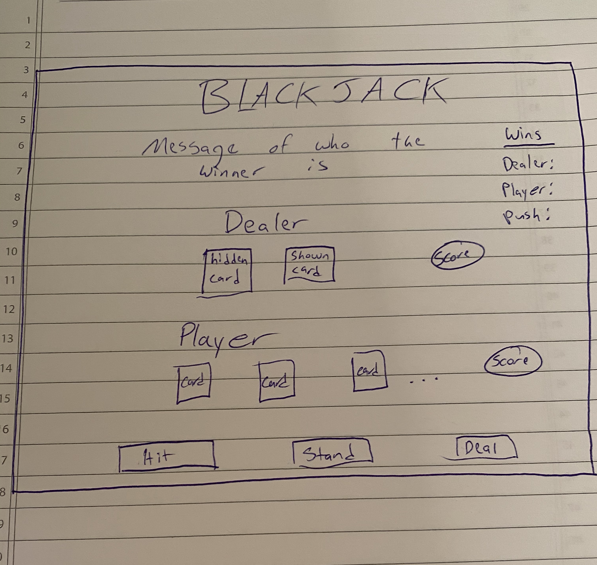

# Blackjack - Project #1

# Description
A blackjack web application. Play the game now at https://rowstonblackjack.netlify.com/. When joining the game, the user has the option to place a bet by clicking the options given as $1, $5, $10, $100, and $500. The user can use a combination of the buttons to get a desired dollar amount. The user can opt out of placing a bet by not clicking any of the buttons with money on them. Once the user has placed the desired bet, they can start the game by clicking the "Deal" button. The "Hit" button is used to draw another card, and the "Stand" button is used to signal that the user wants to play the hand they currently have. A table showing pushes and wins for the dealer and user is displayed at the top left of the screen. To the right of that table are the details of the current bet and available cash with buttons to add money to the current bet. 

# Blackjack Rules
The goal of blackjack is to get the value of your cards equal to 21 or as close to 21 as possible without going over. If the player goes over, then it is a bust and the dealer wins. The values of the cards correspond to their numerical value from 2-10. All face cards (Jack, Queen, King) count 10 and the Ace either 1 or 11, as the user desires. Highest score below 22 wins the round, but a Blackjack (Ace and a card whose value is 10) beats all other combination of cards. If the user wins the hand, the pay-out is 1:1. If the user wins with blackjack, the pay-out is 3:2.  

# Technologies Used
JavaScript, HTML, CSS, Bootstrap, Netlify

# Important Links
https://rowstonblackjack.netlify.com/

Images for the cards:
https://code.google.com/archive/p/vector-playing-cards/downloads

# Wireframe

